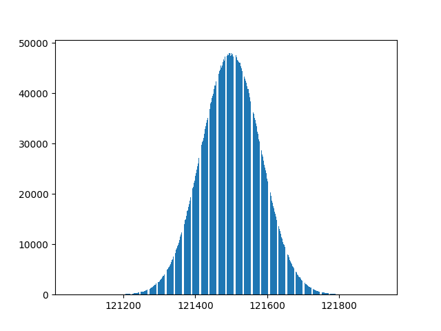
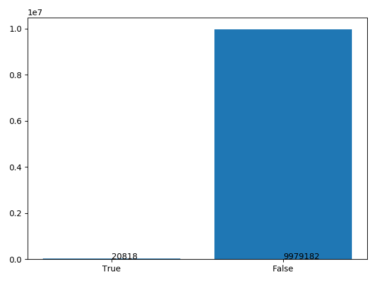

> this is a answer to question which mentioned in lesson


# Question
 think a pile of numbers that we should check whether they are in the Fibonacci series or not.
- **fisrt** most of numbers are duplicated
- **second** make it *fast*

> try to solve it by your own before looking at the answers

## Files Description
- `fastFib.py` is **the main answer**(your answers are welcomed if you can make it faster 😉)
- also I solved this question using a *regular* method and not taking care of time which is in the `regularFib.py`.
- `speedChecker.py` simply examines the other codes speed

## Sample Output
```
generating numbers...
numbers generated...
	biggest number generated: 121918
	smallest number generated:121053
numbers counted...
making the graph...
qt5ct: using qt5ct plugin
...
time elapsed for fast fib is 2.676896810531616
time elapsed for fast fib is 16.891290426254272
	NOTE: all answers match
number of matched items: 20818
number of unmatched items: 9979182
```



