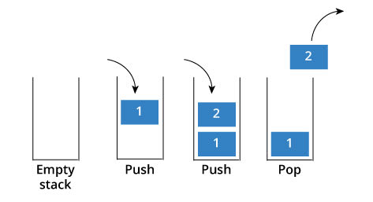

# Class(part2)

lets make an stack...

## a Simple Example
**lets make a class**
### what is stack ?



> TIP: The initial step to make a class is defining its API *(what is API?)*

### API

| function/variable | arguments|returns| description |
| :-------------: | :-------:| :---:|:--- |
| push       |   value:[anytype] | `None` | pushes `value` into stack
pop|-|last item in the stack, `None` if stack is empty | removes the last item in the stack and returns it|
lastItem|-|last item in the stack|like pop but without removing
isEmpty|-|`True` or `False`|returns `True` if stack is empty
size|-| `int` |returns the number of items stored in the stack
str|-|?|?
eq|other stack|?|?


**Question**

1. Implement a stack class
2. describe how to use it in other code

**How to force user not to have access to main data in class?**

### public, private and protected Access Modifiers

**Question**\
 define terms public, private and protected.

```Python
class test:
  """docstring for test."""

  def __init__(self):
    self.public='public' # this is public
    self._protected="protected" # this is protected
    self.__private="private" # this is private
```

> NOTE: that was all joke!!! :)
